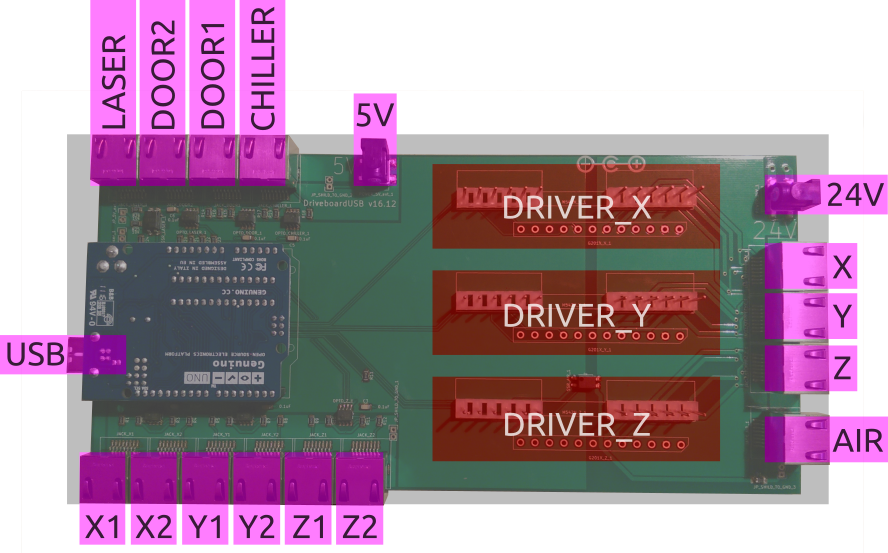

DriveboardUSB
=============

Ports
-----

The board has 1x USB type-B, 2x barrel 2.1mm, 14x RJ45, 3x 12-pin headers.

### USB (1x)

Port for connecting to the computer running DriveboardApp.

- USB, type-B

### Power (2x)

The board is typically powered through two barrel connectors with 5V and 24V. The 5V are used for sensors and control and the 24V are used for driving the steppers and air valve. Alternatively the board can be jumpered to use the 5V from the Laser PSU. In any case the Arduino USB power is optically isolated from any external wiring.

- 5V - barrel 2.1mm, 100mA
- 24V - barrel 2.1mm, 3A (or 75% of summed stepper motor setting)

### Stepper Drivers

The board is designed to work with 2 or 3 stepper drivers (2 or 3 axes). The recommended type is the M542H. Alternatively the board provides a second set of headers for the Geckodrive G201X. In any case the drivers have to be configured through pin switches to match the stepper motors.

- DRIVER_X, 12-pin header
- DRIVER_Y, 12-pin header
- DRIVER_Z, 12-pin header

### Interlocks (9x)

These are the imputs for the limit, door, and chiller switches. Switches are expected to be normally closed (NC). When triggered they should disconnect the loop. The point of the RJ45 jacks is to use ethernet patch cables for external wiring: Flexible Cat5 or Cat6 shielded (FTP, STP, or SFTP) patch cables with 26 AWG. Polarity does not matter.

- CHILLER - RJ45
- DOOR1 - RJ45
- DOOR2 - RJ45
- X1 - RJ45
- X2 - RJ45
- Y1 - RJ45
- Y2 - RJ45
- Z1 - RJ45
- Z2 - RJ45

| pin# | color | interlock  |
| :----: | :----: | :----:|
| pin-1 | orange-white | pin-1 |
| pin-2 | orange | pin-2 |
| pin-3 | green-white | pin-1 |
| pin-4 | blue | - |
| pin-5 | blue-white | - |
| pin-6 | green | pin-2 |
| pin-7 | brown-white | - |
| pin-8 | brown | - |

### Laser Control

The control wire connects to the control port of the laser PSU. The typical pins are `| 5V | TH | TL | WP | IN |` and all but TH need to connected as follows.

 - LASER, RJ45

| pin# | color | laser PSU  |
| :----: | :----: | :----:|
| pin-1 | orange-white | 5V |
| pin-2 | orange | WP |
| pin-3 | green-white | 5V |
| pin-4 | blue | TL |
| pin-5 | blue-white | IN |
| pin-6 | green | WP |
| pin-7 | brown-white | GND |
| pin-8 | brown | GND |

### Stepper Motors

Stepper motors are all driven by energizing two sets of coils. A and A' is one set and B and B' is the other set. This board assumes 2x 26 AWG for wiring and results in a maximum supported nominal current of about 3.5A. Make sure to configure the stepper drivers to match the motors.

- X, RJ45
- Y, RJ45
- Z, RJ45

| pin# | color | motor  |
| :----: | :----: | :----:|
| pin-1 | orange-white | A |
| pin-2 | orange | A' |
| pin-3 | green-white | A |
| pin-4 | blue | B |
| pin-5 | blue-white | B' |
| pin-6 | green | A' |
| pin-7 | brown-white | B' |
| pin-8 | brown | B |

### Air Valve

Electronically speaking the e-valve is basically a solenoid. Polarity does not matter.

- AIR, RJ45

| pin# | color | valve  |
| :----: | :----: | :----:|
| pin-1 | orange-white | pin-1 |
| pin-2 | orange | pin-2 |
| pin-3 | green-white | pin-1 |
| pin-4 | blue | - |
| pin-5 | blue-white | - |
| pin-6 | green | pin-2 |
| pin-7 | brown-white | - |
| pin-8 | brown | - |
